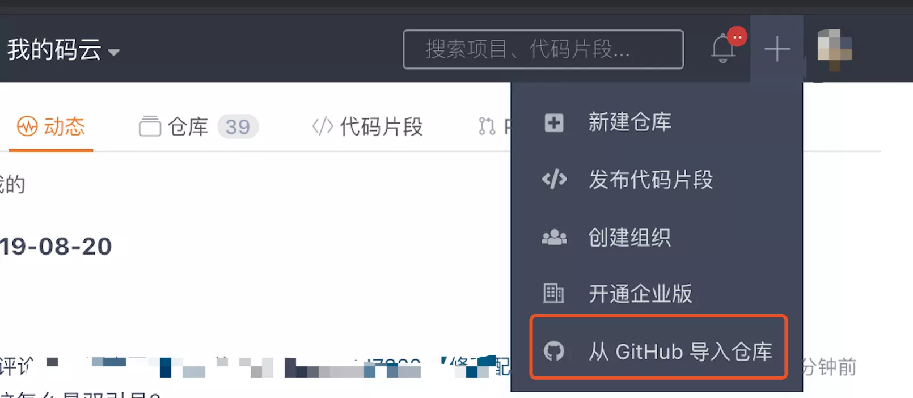
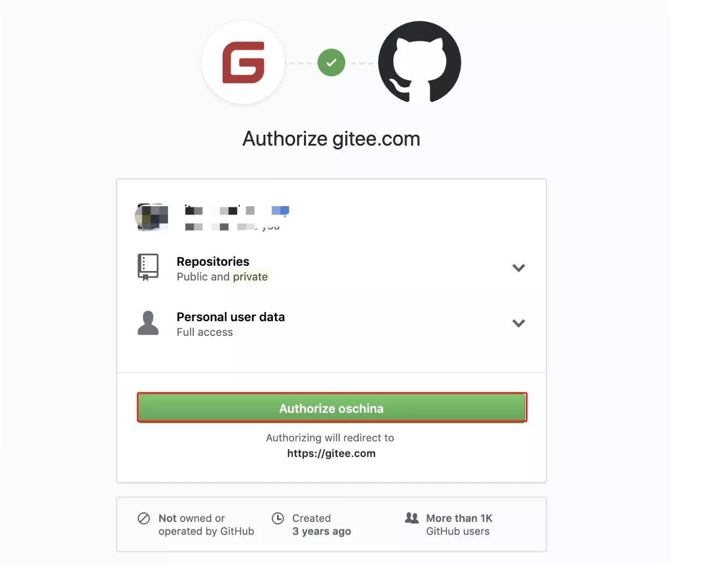
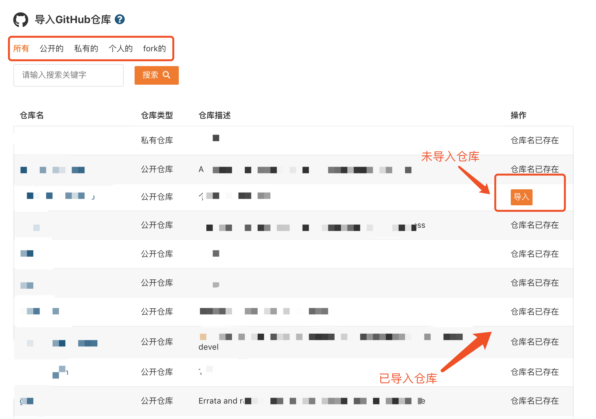
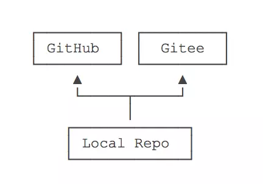

# GitHub仓库快速导入Gitee及同步更新

## 仓库导入

登陆 Gitee 账号，点击右上角的 + 号，点击「从 GitHub 导入仓库」，在跳转的页面中授权 Gitee 访问。



与 GitHub 对接。

 

选择性的导入您的 Github 项目到 Gitee



- 如果是开源的仓库，直接点击创建即可，导入完成即进入相应 Gitee 的仓库页面（导入速度可能会因仓库大小、网络状况而有所差异，请耐心等待）

- 如果是私有仓库，需要登录有权限操作该仓库的 GitHub 账号进行授权，授权后结果同上

## Gitee 和 Github 同步更新

### 方法一（推荐）：比较少分支的仓库

  如果是本地仓库，只在需要命令行添加用不同名称标识的 Gitee  和 Github 远程库。

  `git remote add 远程库名 远程库地址`

  

具体方法操作如下：

1、首先通过 git remote -v 查看您要同步的仓库的远程库列表，如果在列表中没有您码云的远程库地址，您需要新增一个地址

```
git remote add 远程库名 远程库地址
eg: git remote add gitee git@github.com:xxx/xxx.git
```

如果在 add 的时候出现error: Could not remove config section 'remote.xxx'.一类的错误，通过把仓库下.git/config 文件里面的 [remote "xxx"] 删掉或者是用别的远程库名即可。

2、从 GitHub 上拉取最新代码到本地

```
git pull 远程库名 分支名
eg：git pull origin master
```

3、推送本地最新代码到 Gitee 上

```
git push 远程库名 分支名
eg：git push gitee master
```

如果出现有差异的话需要自己手动解决差异

### 方法二（推荐）：比较多分支的仓库

1、克隆 GitHub 仓库到本地，命令如下

```
$ git clone git@github.com:xxx/xxx.git
# 进入仓库目录
$ cd xxx 
```

2、一次性拉取该仓库的所有分支，命令如下：

`$ for b in `git branch -r | grep -v -- '->'`; do git branch --track ${b##origin/} $b; done`

命令简单解释：

- | 表示通道，即前面命令的输出是后面命令的输入。
- for xxx in xxxs; do xxx; done是shell的for循环语句。
- 倒引号``表示里面的是命令。
- git branch -r 列出远程分支。
- grep -v – ‘->’ ，grep查找命令，-v 参数表示not grep ，即查找输入中的不含’->’ 的行。
- git branch -r | grep -v – ‘->’ ，合起来就是参看远程分支中除了含有’->’ 的分支。
- $b 表示远程分支名，例如：origin/dev。
- ${b##origin/} 表示截取远程分支名中origin/后面的内容，例如：dev，以此当做本地分支。
- git branch --track {b##origin/}{b##origin/}b，类似于方法1的git branch dev origin/dev，–track参数是默认的，不加亦可。

3、查看所有分支（包括本地和远程仓库分支）

`git branch --all`

4、推送本地仓库到 Gitee 上

### 方法三：比较多分支的仓库

在 Gitee 仓库主页点击同步更新按钮即可！


**这里的同步功能默认是强制同步（新代码直接覆盖）**

参考文章链接：

码云官方博客：<https://blog.gitee.com/2018/06/05/github_to_gitee/>